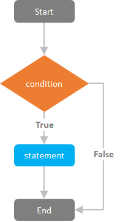

# Table of Contents

1. Introduction to programming - basic informations
   1. What is programming (definition)
      1. The act or process of writing a program so that data may be processed by a computer. _Collins English Dictionary. Copyright © HarperCollins Publishers_
      2. Computer programming is the process of performing a particular computation (or more generally, accomplishing a specific computing result), usually by designing/building an executable computer program. _Wikipedia_
      3. _PDFs:_
         1. __[_https://dl.acm.org/doi/pdf/10.1145/9758.10501_](https://dl.acm.org/doi/pdf/10.1145/9758.10501)__
         2. [http://citeseerx.ist.psu.edu/viewdoc/download?doi=10.1.1.58.1345\&rep=rep1\&type=pdf](http://citeseerx.ist.psu.edu/viewdoc/download?doi=10.1.1.58.1345\&rep=rep1\&type=pdf)
   2. Why you should learn programming [https://www.youtube.com/watch?v=Dv7gLpW91DM](https://www.youtube.com/watch?v=Dv7gLpW91DM)
   3. historia rozwoju języków i technik programowania,&#x20;
      1. Karty perforowane
      2. COBOL
      3. ciekawostki
   4. Programming as a instructions for computer
      1. Programming is to giving computer right instructions required to accomplished a task.
      2. Example with LEGO instructions (step by step what to do to achieve results)
   5. Program environments
      1. Client program
      2. Container program
      3. Server program
      4. AWS Lambda and serverless
   6. Programming IDEs (overview)
      1. What is IDE
      2. VSCode
      3. JetBrains IDEs
   7. Pseudocode
      1. Pseudocode is a plain language description of the steps in an algorithm or another system.
      2. Writing example program in pseudocode: calculating shopping cart
      3. Special variation of pseudocode: Gherkin Language and Domain Driven Development
   8. Programming languages
      1. Low level programming and assembly language example
      2. High level programming and C# examples
      3. Interpreted languages and PHP examples
   9. The same program in other high-level languages
      1. Python
      2. JavaScript
      3. PHP
      4. C#
      5. C++
   10. Definicje pojęć: translator, kompilator, interpreter, moduł programowy.
2. What is a variable. Introduction to variables based on PHP
   1. Definition of variable
      1. A variable is a symbolic name for (or reference to) information. The variable's name represents what information the variable contains. They are called variables because the represented information can change but the operations on the variable remain the same. In general, a program should be written with "Symbolic" notation, such that a statement is always true symbolically. For example, if I want to know the average of two grades, We can write "average = (grade\_1 + grade\_2) / 2.0;" and the variable average will then contain the average grade regardless of the scores stored in the variables, grade\_1 and grade\_2. _Utah University_ [_https://www.cs.utah.edu/\~germain/PPS/Topics/index.html_](https://www.cs.utah.edu/\~germain/PPS/Topics/index.html)__
      2. In computer programming, a variable is an abstract storage location paired with an associated symbolic name, which contains some known or unknown quantity of information referred to as a value; or in simpler terms, a variable is a container for a particular set of bits or type of data (like integer, float, String etc...). _Wikipedia_
   2. Variable types in PHP language
      1. What is a primitive variable and what is nonprimitive variable
      2. Variable types in PHP: [https://www.php.net/manual/en/language.types.intro.php](https://www.php.net/manual/en/language.types.intro.php)
         1. Scalar types:
            1. Boolean - true / false
            2. Integer - An int is a number of the set ℤ = {..., -2, -1, 0, 1, 2, ...}.
            3. Float - float number
            4. String - A string is a series of characters, where a character is the same as a byte.
         2. Compound types
            1. array - An array in PHP is actually an ordered map. A map is a type that associates _values_ to _keys_. This type is optimized for several different uses; it can be treated as an array, list (vector), hash table (an implementation of a map), dictionary, collection, stack, queue, and probably more. As array values can be other arrays, trees and multidimensional arrays are also possible.
            2. object - it's an instance of a class including anonymus class like in javascript `{...}`
            3. callable - callable function assign to the variable (reffered to functional programming)
            4. iterable - Iterable is a pseudo-type introduced in PHP 7.1. It accepts any array or object implementing the Traversable interface. Both of these types are iterable using foreach and can be used with yield from within a generator.
         3. Special types
            1. null - represents a variable with no value
            2. Resource - A resource is a special variable, holding a reference to an external resource.
      3. Other types on variables in different languages
      4. Casting variables
   3. Variable scope
      1. What is variable scope [https://www.php.net/manual/en/language.variables.scope.php](https://www.php.net/manual/en/language.variables.scope.php)
         1. The scope of a variable is the context within which it is defined. For the most part all PHP variables only have a single scope. This single scope spans included and required files as well.
      2. Global / Static variables in php
      3. Variable scope in javascript: [https://www.w3schools.com/js/js\_scope.asp](https://www.w3schools.com/js/js\_scope.asp)
         1. var / let / const
   4. Constants
      1. Definition of constant
         1. A constant is a value that should not be altered by the program during normal execution, i.e., the value is constant. _Wikipedia_
         2. A constant is an identifier (name) for a simple value. As the name suggests, that value cannot change during the execution of the script (except for magic constants, which aren't actually constants). _php.net_
      2. Where to use constants
         1. Avoid magic numbers for example day represented in seconds.
      3. Enumerated values
         1. Enumerated values are not the same as constants, but often take the same job in code.&#x20;
         2. Enumerations, or "Enums" allow a developer to define a custom type that is limited to one of a discrete number of possible values. That can be especially helpful when defining a domain model, as it enables "making invalid states unrepresentable."
   5. Arrays
      1. Array definition
         1. An array is a data structure consisting of a collection of elements (values or variables), each identified by at least one array index or key.
         2. An array in PHP is actually an ordered map. A map is a type that associates _values_ to _keys_. This type is optimized for several different uses; it can be treated as an array, list (vector), hash table (an implementation of a map), dictionary, collection, stack, queue, and probably more. As array values can be other arrays, trees and multidimensional arrays are also possible.
      2. Arrays in php
         1. Declare an array
         2. Declare associative array
         3. Array Operators [https://www.php.net/manual/en/language.operators.array.php](https://www.php.net/manual/en/language.operators.array.php)
   6. Naming convention
      1. Naming convention is a set of rules for choosing the character sequence to be used for identifiers which denote variables, types, functions, and other entities in source code and documentation. [https://en.wikipedia.org/wiki/Naming\_convention\_(programming)](https://en.wikipedia.org/wiki/Naming\_convention\_\(programming\))
   7. Variables, constants and enums in php - code examples
      1. Variable types
      2. Variable scope
      3. Variable casting
      4. Predefined Variables in PHP
      5. Defining global constants
      6. Defining class constants
      7. Enums in php
3. Expressions, control structures and operators. How to work with them, based on PHP
   1. Definition of Expression&#x20;
      1. In computer science, an expression is a syntactic entity in a programming language that may be evaluated to determine its value. _Wikipedia_
      2. Expressions are the most important building blocks of PHP. In PHP, almost anything you write is an expression. The simplest yet most accurate way to define an expression is "anything that has a value". _php.net_
   2. Examples of assigning Expressions
      1. [https://www.php.net/manual/en/language.expressions.php](https://www.php.net/manual/en/language.expressions.php)
   3. Definition of control structure
      1. A structure is used to affect the flow of a program.
      2. 
      3. Each program has it's own flow. From start to end, algorithm process tasks, are required to achieve results. For controlling those flow, we are using control strucutres, like:
         1. if
         2. else
         3. elseif/else if&#x20;
         4. while&#x20;
         5. do-while&#x20;
         6. for&#x20;
         7. foreach&#x20;
         8. break&#x20;
         9. continue&#x20;
         10. switch&#x20;
         11. match&#x20;
         12. declare&#x20;
         13. return
         14. goto
   4. Definition of Operator
      1. An operator is something that takes one or more values (or expressions, in programming jargon) and yields another value (so that the construction itself becomes an expression). _php.net_
   5. Operators in PHP
      1. Operator Precedence [https://www.php.net/manual/en/language.operators.precedence.php](https://www.php.net/manual/en/language.operators.precedence.php)
      2. Arithmetic Operators [https://www.php.net/manual/en/language.operators.arithmetic.php](https://www.php.net/manual/en/language.operators.arithmetic.php)
      3. Assignment Operators [https://www.php.net/manual/en/language.operators.assignment.php](https://www.php.net/manual/en/language.operators.assignment.php)
      4. Comparison Operators [https://www.php.net/manual/en/language.operators.comparison.php](https://www.php.net/manual/en/language.operators.comparison.php)
      5. Incrementing/Decrementing Operaton [https://www.php.net/manual/en/language.operators.increment.php](https://www.php.net/manual/en/language.operators.increment.php)
      6. Logical Operators [https://www.php.net/manual/en/language.operators.logical.php](https://www.php.net/manual/en/language.operators.logical.php)
      7. String Operators [https://www.php.net/manual/en/language.operators.string.ph](https://www.php.net/manual/en/language.operators.string.php)
4. Functions
   1. Function - definition
      1. Functions are "self contained" modules of code that accomplish a specific task. Functions usually "take in" data, process it, and "return" a result. Once a function is written, it can be used over and over and over again. Functions can be "called" from the inside of other functions. _Utah Univerity_ [_https://www.cs.utah.edu/\~germain/PPS/Topics/functions.html_](https://www.cs.utah.edu/\~germain/PPS/Topics/functions.html)__
   2. Why do we write functions
      1. They allow us to conceive of our program as a bunch of sub-steps. (Each sub-step can be its own function. When any program seems too hard, just break the overall program into sub-steps!)
      2. They allow us to reuse code instead of rewriting it.
      3. Functions allow us to keep our variable namespace clean (local variables only "live" as long as the function does). In other words, function\_1 can use a variable called i, and function\_2 can also use a variable called i and there is no confusion. Each variable i only exists when the computer is executing the given function.
      4. Functions allow us to test small parts of our program in isolation from the rest. This is especially true in interpreted langaues, such as PHP
   3. Namespaces
      1. Namespace is a set of signs (names) that are used to identify and refer to objects of various kinds. A namespace ensures that all of a given set of objects have unique names so that they can be easily identified.
      2. Using namespace we can keep our code clean and easy to use. For example, we can have a function with the same name, but using namespace, we can target specific one.   In that case it is better to have class for that, but even then we are using namespaces for class definitions.
   4. Steps to Writing a Function
      1. Understand the purpose of the function.&#x20;
      2. Define the data that comes into the function from the caller (in the form of parameters)!&#x20;
      3. Define what data variables are needed inside the function to accomplish its goal.&#x20;
      4. Decide on the set of steps that the program will use to accomplish this goal. (The Algorithm)
   5. Keeping functions clean
      1. Find right name for your function
      2. According to Single responsibility principle, make sure, that your function doing only one specific task
      3. Try to keep maximum 3 arguments for a function. If it needs to have more data, try to close them in class instances, like Data Transfer Object or ValueObjects.
      4. Function should always return the same type of value, or the same type of value with null allowed.
   6. Anonymous function / arrow functions [https://en.wikipedia.org/wiki/Anonymous\_function](https://en.wikipedia.org/wiki/Anonymous\_function)
      1. Anonymous function (function literal, lambda abstraction, lambda function, lambda expression or block) is a function definition that is not bound to an identifier.
      2. It's not saved in memory, but stored inside variable
   7. Recursion
      1. Recursion is a process in which a function calls itself as a subroutine. This allows the function to be repeated several times, since it calls itself during its execution. Functions that incorporate recursion are called recursive functions.
      2. Exit instruction - required to end program
      3. Example of recursion function - counting factorial of 5 (5!)
      4. _Chapter III of Grokking Algorithms: An Illustrated Guide for Programmers and Other Curious People_
   8. Functional programming - basics
      1. Functional programming is a programming paradigm where programs are constructed by applying and composing functions.
      2. In PHP Functional programming is not very popular concept, however using callables in frameworks like Laravel is quite often. Functional programming is more popular in JavaScript / TypeScript, especially in React
      3. You can learn more about it from this video in polish [https://www.youtube.com/watch?v=kpsS47lNpmI](https://www.youtube.com/watch?v=kpsS47lNpmI) or from [https://www.youtube.com/watch?v=0if71HOyVjY](https://www.youtube.com/watch?v=0if71HOyVjY) but since it's introduction to programming, more informations you can find on programming paradigms lessons.
   9. Code examples in PHP
      1. Defining a function
      2. Defining a function in namespace
      3. Running function within other function
      4. Refactoring big non SOLID function to smaller once
      5. Refactoring function with many arguments to function with less agruments
      6. Refactoring function that returns string / number / boolean to strict type
      7. Arrow function
      8. Recursion function that calculates factorial
      9. Function as a parameter of other function
5. Object-oriented programming
   1. Type Operators[https://www.php.net/manual/en/language.operators.type.php](https://www.php.net/manual/en/language.operators.type.php)
   2. Exceptions Obsługa sytuacji wyjątkowych: sytuacje wyjątkowe, rzucanie wyjątków, łapanie wyjątków, informowanie o rzucanych wyjątkach, hierarchie klas do przechowywania informacji o wyjątkach, sprzątanie stosu, pozyskiwanie zasobów poprzez inicjalizację.&#x20;
      1. Złe praktyki związane ze sterowaniem poprzez wyjątki
   3. Różnice Interfejs / Klasa; Klasa abstrakcyjna / finalna
   4. Podstawy programowania obiektowo orientowanego: dziedziczenie, dziedziczenie wielopokoleniowe, hierarchia klas, dostęp do składników w kontekście dziedziczenia, konstrukcja obiektów w kontekście dziedziczenia, dziedziczenie wielokrotne.&#x20;
   5. Klasy abstrakcyjne: metody abstrakcyjne, cechy klasy abstrakcyjnej, poŜytki z klasy abstrakcyjnej, interfejsy, siła klas abstrakcyjnych, istota programowania obiektowo orientowanego.&#x20;
   6. Dobre praktyki programowania
      * KISS
      * DRY
      * Czysty kod
   7. Konstruktory / destruktory
   8. Metody magiczne php
   9. Wprowadzenie do wzorców projektowych
6. SOLID principles
   1. S
   2. O
   3. L
   4. I
   5. D
7. GRASP
   1. GRASP principles
8. What is an algorithm
   1. What is an algorithm (definition)
      1. A set of mathematical instructions or rules that, especially if given to a computer, will help to calculate an answer to a problem. _Cambridge Advanced Learner's Dictionary & Thesaurus © Cambridge University Press_&#x20;
      2. In mathematics and computer science, an algorithm is a finite sequence of well-defined instructions, typically used to solve a class of specific problems or to perform a computation. _Wikipedia_
   2. Example of algorithm - binary search
      1. We have a radom number from 1 to 1.000.000 what is an algorithm to find that number if we can get response that given number is lower or higher then result.
      2. Pen & paper metod (you don't need always to use flowcharts)
      3. Flowchart with [https://www.lucidchart.com/](https://www.lucidchart.com)
      4. Pseudocode
      5. Big O notation (in example of binaty search O(logn))
      6. Program in javascript
   3. Sortowanie
   4. Listy (LIFO, FIFO)
   5. Inne
   6. Schemat blokowy; zestaw instrukcji; program.
9. Bulid-in functions in PHP
   1. Podstawowe biblioteki i narzędzia wejście i wyjście programu.
   2. Include / required
   3. Pliki. Deklarowanie, otwieranie i zamykanie. Dodawanie danych do pliku.
10. Debugging your code
    1. Jak debugować kod
       * proste narzędzia do debugowania
       * zasada gumowej kaczuszki
       * narzędzia do debugowania (zależne od języka, pokazać w przeglądarce)
       * pisanie testów jako rozwiązanie umożliwiające debugowanie
11. PHP Frameworks
    1. Laravel
    2. Symfony
12. Data structures
    1. struktury danych
       * Czym są
       * Jakie są rodzaje
       * Przykłady
13. Version control system
    1. Definition
    2. GIT
    3. praca na gicie
14. Test driven development
15. Wyrażenie regularne

